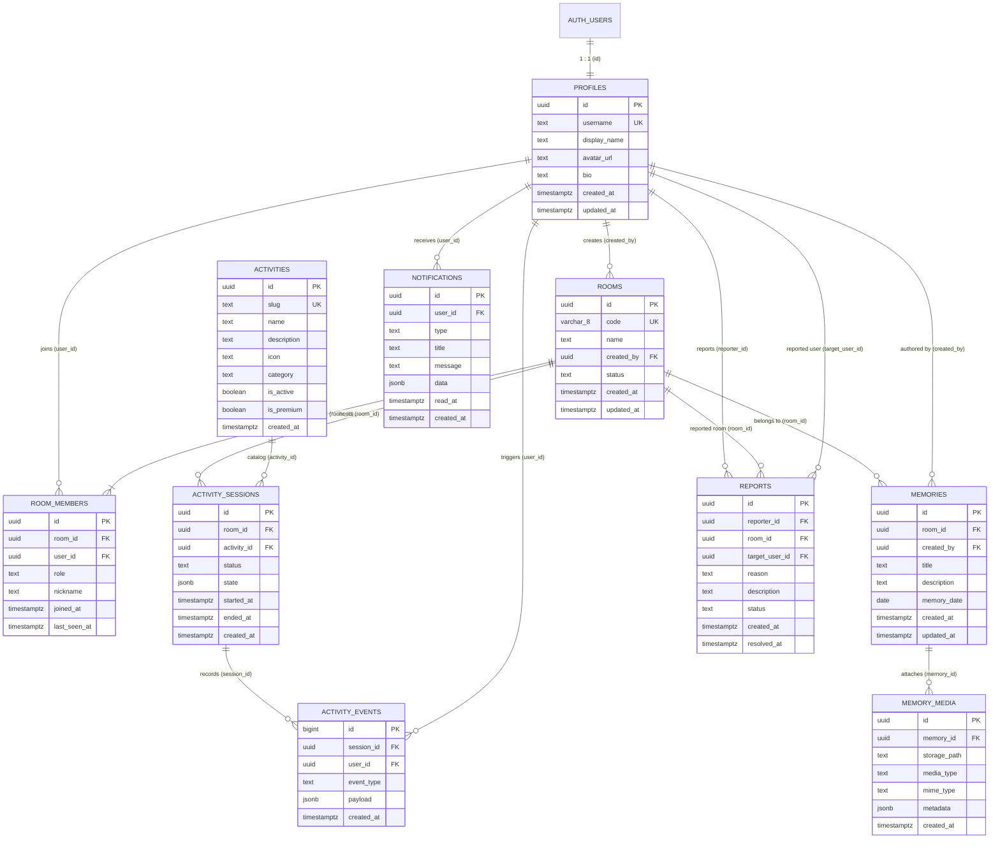

<div align="center">


# 💗 Pairly
### _Make moments together._

A modern, intimate, and private realtime platform for two people to create, play, and cherish moments together — crafted especially for couples and long-distance relationships.

[](https://nextjs.org/)
[](https://react.dev/)
[](https://www.typescriptlang.org/)
[](https://supabase.com/)
[](https://www.postgresql.org/)
[](https://tailwindcss.com/)
[](https://turbo.build/)
[](https://pnpm.io/)

</div>

---

## ✨ Features & Visual Direction

- 🌸 **Modern Romantic Visual Direction** — Clean white-dominant UI, soft rose and pink accents (`#F43F5E`, `#FB7185`), subtle glowing shadows, and rounded cards.
- ⚡ **Realtime Architecture** — Ephemeral states (cursor movements, typing indicators, presence) via Supabase Broadcast channels, and authoritative state synchronizations via Postgres Change Streams (`REPLICA IDENTITY FULL`).
- 🔒 **Zero-Trust Privacy & RLS** — Comprehensive Row-Level Security (RLS) policies guaranteeing that only two connected partners have access to their private room, memories, and activity sessions.
- 👫 **Hardened 2-Member Room Limit** — Transaction-safe PostgreSQL row-level locking trigger (`FOR UPDATE`) preventing race conditions during concurrent joins.
- 🎲 **Interactive Activities Catalog** — Realtime couples quizzes, shared canvas doodling, retro photobooth, memories timeline, truth or dare, and playful mini-games.
- 📁 **Private Media Storage** — Room-aware storage security for couple photo strips, romantic journals, and audio notes.
- 🧩 **Modular Monorepo** — Scalable architecture orchestrated with Turborepo and pnpm workspaces.

---

## 🏛️ Database Architecture & Entity Relationship Diagram (ERD)

Pairly is powered by Supabase PostgreSQL with **10 core application tables** and **13 sequential migrations**:



---

## 🗄️ Sequential Migrations Roadmap

All migrations live under [`supabase/migrations/`](./supabase/migrations/) and execute lexicographically:

| Migration File | Target & Purpose | Security / Rules |
| :--- | :--- | :--- |
| `0001_extensions.sql` | `uuid-ossp`, `pgcrypto` in `extensions` schema | Cryptographic random generation |
| `0002_profiles.sql` | `profiles` table & `handle_new_user()` trigger | Auto-creates profile upon Supabase Auth signup |
| `0003_rooms.sql` | `rooms` & `room_members` tables | `generate_room_code()` + Max 2 members lock trigger |
| `0004_activities.sql` | `activities` interactive games catalog | Read-only catalog for regular users |
| `0005_activity_sessions.sql` | `activity_sessions` stateful room instances | Persistent session state tracking (`state JSONB`) |
| `0006_activity_events.sql` | `activity_events` append-only audit & milestones | Audit trail (ephemeral state uses Realtime) |
| `0007_memories.sql` | `memories` & `memory_media` tables | Shared romantic scrapbook & media references |
| `0008_notifications.sql` | `notifications` in-app alerts | Partner activity notifications & unread index |
| `0009_reports.sql` | `reports` safety & moderation | User moderation foundation |
| `0010_functions_and_triggers.sql` | `set_updated_at()`, `is_room_member()`, `is_room_owner()` | Recursion-safe `SECURITY DEFINER` RLS helpers |
| `0011_rls.sql` | Row Level Security policies on all 10 tables | Strict `auth.uid()` and room membership isolation |
| `0012_realtime.sql` | Realtime publication configuration | `REPLICA IDENTITY FULL` on collaborative tables |
| `0013_storage.sql` | Buckets (`avatars`, `memories`, `photobooth`) | Room-aware Storage RLS for private couple media |
| `seed.sql` | Initial catalog activities | Idempotent `ON CONFLICT (slug) DO UPDATE` |

---

## 🏗️ Monorepo Structure

```text
pairly/
├── apps/
│   └── web/                   # Next.js 16 (App Router + Turbopack + Tailwind + shadcn/ui)
├── packages/
│   ├── database/              # Supabase SSR client, database.types.ts & type helpers
│   ├── types/                 # Shared TypeScript domain contracts & realtime event types
│   ├── ui/                    # Reusable UI component library (shadcn/ui based)
│   ├── utils/                 # Shared utility functions (cn, formatters)
│   ├── validation/            # Runtime Zod validation schemas (rooms, auth, profiles)
│   └── config/                # Shared TypeScript compiler configurations
├── supabase/
│   ├── migrations/            # 13 ordered PostgreSQL migrations & RLS policies
│   └── seed.sql               # Initial activities catalog seed data
├── pnpm-workspace.yaml         # Monorepo package registry
├── turbo.json                 # Turborepo task pipeline configuration
└── package.json               # Root scripts and engine requirements
```

---

## 🚀 Getting Started / Cara Instalasi

Ikuti langkah-langkah di bawah ini untuk menginstal dan menjalankan Pairly di environment lokal Anda:

### 1. Prasyarat Sistem

- **Node.js**: `v18.18.0` atau lebih baru (disarankan **Node.js v22 LTS**)
- **pnpm**: `v9.0.0` atau lebih baru (disarankan **pnpm v10+**)
- **Git**

```bash
npm install -g pnpm
```

### 2. Clone Repository

```bash
git clone https://github.com/vexalyn-dev/Pairly.git
cd Pairly
```

### 3. Instalasi Dependencies

```bash
pnpm install
```

### 4. Konfigurasi Environment Variables

Salin template `.env.example` menjadi `.env.local`:

```bash
# Windows PowerShell
copy .env.example .env.local

# Linux / macOS / Bash
cp .env.example .env.local
```

Isi kredensial Supabase di `.env.local`:

```env
NEXT_PUBLIC_SUPABASE_URL=https://your-project-id.supabase.co
NEXT_PUBLIC_SUPABASE_ANON_KEY=your-publishable-anon-key
SUPABASE_SERVICE_ROLE_KEY=your-secret-service-role-key
NEXT_PUBLIC_APP_URL=http://localhost:3000
```

### 5. Menjalankan Server Development

```bash
pnpm dev
```

Akses di browser: 👉 **[http://localhost:3000](http://localhost:3000)**

### 6. Database & Quality Verification

```bash
# Cek daftar status migrasi
pnpm db:list

# Regenerasi TypeScript Database Types
pnpm db:types

# Quality check & production build
pnpm lint
pnpm typecheck
pnpm build
```

---

## 🛠️ Tech Stack Overview

| Category | Technology |
| :--- | :--- |
| **Framework** | [Next.js 16](https://nextjs.org/) (App Router, Turbopack) |
| **Core UI** | [React 19](https://react.dev/), [Tailwind CSS](https://tailwindcss.com/), [shadcn/ui](https://ui.shadcn.com/) |
| **Icons** | [Lucide React](https://lucide.dev/) |
| **Database & Realtime** | [Supabase](https://supabase.com/) (PostgreSQL 15+, Realtime, Storage, Auth) |
| **Database Types** | Auto-generated TypeScript Database Types (`database.types.ts`) |
| **Validation** | [Zod](https://zod.dev/) |
| **Monorepo Engine** | [Turborepo](https://turbo.build/) & [pnpm Workspaces](https://pnpm.io/workspaces) |
| **Formatting** | [Prettier](https://prettier.io/) |

---

## 👥 Developers & Core Team

Pairly dikembangkan dan dirancang oleh:

| Developer | Role |
| :--- | :--- |
| **[Vexalyn Dev](https://github.com/vexalyn-dev)** | Lead Full-Stack Engineer & Core Architect |
| **Raffa** | Co-Developer & Full-Stack Engineer |

---

## 🔒 Copyright & Proprietary Notice

**Copyright © 2026 Vexalyn Dev & Raffa. All Rights Reserved.**

> **PROPRIETARY & CONFIDENTIAL**  
> Proyek ini **BUKAN** proyek open source dan **TIDAK** dilisensikan di bawah lisensi publik (seperti MIT, Apache, GPL, dll).  
> Seluruh kode sumber, aset desain, branding, nama, dan arsitektur adalah milik eksklusif **Vexalyn Dev** dan **Raffa**. Penggandaan, distribusi, publikasi, atau penggunaan tanpa izin tertulis dari pemilik hak cipta dilarang keras.
